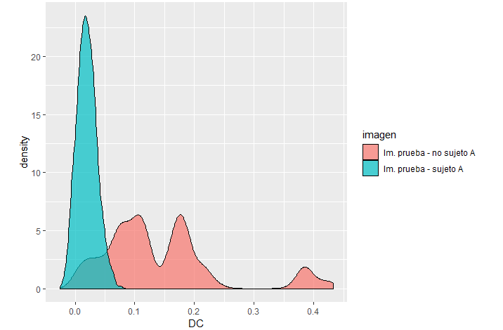

Por Gerardo Lugo Torres y Jorge Padilla Gaona

# Cargamos las librerias

```{r}
library(EBImage)
library(readbitmap)
library(fftwtools)
library(rgl)
library(ggplot2)
source("fftshift.R") # centra el espectro de frecuencias
source("PCE.R") # Calcula PCE
source("PSR.R") # Calcula PSR
source("DC.R") # Calcula DC

```

# Prueba de Filtro CMF

```{r}
dir1="data.JPG"
Subject = LETTERS[1:13]
Number = c("00", "01", "02", "03", "04", "05", "06", "07", "08", "09", 
           "10", "11", "12", "13", "14", "15", "16", "17", "18", "19",
           "20", "21", "22", "23", "24", "25", "26", "27", "28", "29",
           "30", "31", "32", "33", "34", "35", "36", "37", "38", "39",
           "40", "41", "42", "43", "44", "45", "46", "47", "48", "49",
           "50", "51", "52", "53", "54", "55", "56", "57", "58", "59",
           "60", "61", "62", "63", "64", "65", "66", "67", "68", "69",
           "70", "71", "72", "73", "74")
n=10000 # numero de pruebas
set.seed(50)
TEST <- data.frame()
TESTpa <- data.frame()
for (k in 1:n) {
      # carga indices aleatorios
      SubjectP <- sample(Subject[2:13], 1)
      Ns <- sample(Number, 3, replace = FALSE)
      # lee imagenes de filtro y prueba
      img = Image(rotate(read.bitmap(paste0(dir1,Subject[1],Ns[1],".bmp"))/255/64/64,angle = 90))
      imgp = Image(rotate(read.bitmap(paste0(dir1,SubjectP,Ns[1],".bmp"))/255/64/64,angle = 90))
      img2 = Image(rotate(read.bitmap(paste0(dir1,Subject[1],Ns[3],".bmp"))/255/64/64,angle = 90))

      # calcula FFT a las imagenes
      fft1 <- fftshift(fftw2d(img))
      fft2 <- fftshift(fftw2d(imgp))
      fft3 <- fftshift(fftw2d(img2))

      # Filtros CMF
      H <- fftshift(fftw2d(img))
      H[is.na(H)] <- 0

      # Hace las correlaciones
      img_cor1 <- fftshift(fftw2d(fft1*Conj(H), inverse = TRUE))
      img_cor2 <- fftshift(fftw2d(fft2*Conj(H), inverse = TRUE))
      img_cor3 <- fftshift(fftw2d(fft3*Conj(H), inverse = TRUE))

      # Hace pruebas imagenes sin filtro PA
      TEST[2*k-1,1] <- PCE(img_cor1)
      TEST[2*k,1] <- PCE(img_cor1)
      TEST[2*k-1,2] <- PCE(img_cor2)
      TEST[2*k,2] <- PCE(img_cor3)
      
      TEST[2*k-1,3] <- PSR(Mod(img_cor1), Vec = 15)
      TEST[2*k,3] <- PSR(Mod(img_cor1), Vec = 15)
      TEST[2*k-1,4] <- PSR(Mod(img_cor2), Vec = 15)
      TEST[2*k,4] <- PSR(Mod(img_cor3), Vec = 15)
      
      TEST[2*k-1,5] <- DC(img_cor1, img_cor2, Co = c(32,32), Cc = c(32,32), Vec = 15)
      TEST[2*k,5] <- DC(img_cor1, img_cor3, Co = c(32,32), Cc = c(32,32), Vec = 15)
      
      TEST[2*k-1,6] <- "Im. prueba - no sujeto A"
      TEST[2*k,6] <- "Im. prueba - sujeto A"

      TEST[2*k-1,7] <- paste0(Subject[1],Ns[1],"-",Subject[1],Ns[3],"vs",SubjectP,Ns[2])
      TEST[2*k,7] <- paste0(Subject[1],Ns[1],"-",Subject[1],Ns[3],"vs",SubjectP,Ns[2])
}
colnames(TEST) <- c("PCEH", "PCE", "PSRH", "PSR", "DC", "imagen", "sample")


```


```{r }

ggplot(data=TEST, aes(DC,fill=imagen)) +  geom_density(alpha=0.7)

```





```{r}
ggplot(data=TEST, aes(PCE,fill=imagen)) +  geom_density(alpha=0.7)

```


```{r}

ggplot(data=TEST, aes(PSR,fill=imagen)) +  geom_density(alpha=0.7)


```


```{r}

ggplot(TEST, aes(PCE, PSR, color = imagen)) +
      geom_point(size = 2, alpha = 0.15)
```


```{r}
set.seed(200)
SubjectP <- sample(Subject[2:13], 1)
Ns <- sample(Number, 3, replace = FALSE)
# lee imagenes de filtro y prueba
img = Image(rotate(read.bitmap(paste0(dir1,Subject[1],Ns[1],".bmp"))/255/64/64,
                   angle = 90))
imgp = Image(rotate(read.bitmap(paste0(dir1,SubjectP,Ns[1],".bmp"))/255/64/64,
                    angle = 90))
img2 = Image(rotate(read.bitmap(paste0(dir1,Subject[1],Ns[3],".bmp"))/255/64/64,
                    angle = 90))
# calcula FFT a las imagenes
fft1 <- fftshift(fftw2d(img))
fft2 <- fftshift(fftw2d(imgp))
fft3 <- fftshift(fftw2d(img2))
# Filtros CMF
H_cmf <- fftshift(fftw2d(img))
H_cmf[is.na(H_cmf)] <- 0
# Hace las correlaciones
img_cor1 <- fftshift(fftw2d(fft1*Conj(H_cmf), inverse = TRUE))
img_cor2 <- fftshift(fftw2d(fft2*Conj(H_cmf), inverse = TRUE))
img_cor3 <- fftshift(fftw2d(fft3*Conj(H_cmf), inverse = TRUE))

maxcor <- max(Mod(img_cor1))
display(combine(img*64*64, imgp*64*64, img2*64*64,
                Mod(img_cor1)/maxcor,
                Mod(img_cor2)/maxcor,
                Mod(img_cor2)/maxcor),
        all=TRUE, method = "raster")
text(x = 2, y = 2, label = paste("Imagen diseño filtro - sujeto", Subject[1]), adj = c(0,1),
     col = "red", cex = 1)
text(x = 64 + 2, y = 2, label = paste("Imagen prueba - sujeto", SubjectP), adj = c(0,1),
     col = "red", cex = 1)
text(x = 128 + 2, y = 2, label = paste("Imagen prueba - sujeto", Subject[1]), adj = c(0,1),
     col = "red", cex = 1)

text(x = 2, y = 64 + 2, label = paste("Autocorrelacion sujeto", Subject[1]), adj = c(0,1),
     col = "red", cex = 1)
text(x = 64 + 2, y = 64 + 2, label = paste("Correlacion imagen sujeto", SubjectP), adj = c(0,1),
     col = "red", cex = 1)
text(x = 128 + 2, y = 64 +  2, label = paste("Correlacion imagen sujeto", Subject[1]), adj = c(0,1),
     col = "red", cex = 1)

```


```{r}

# carga imagenes de correlaciones (se ejecuta al final)
cor1 <- readImage("Autocorrelacion_cmf.png")
cor2 <- readImage("Correlacion Cruzada 1_cmf.png")
cor3 <- readImage("Correlacion Cruzada 2_cmf.png")
display(combine(cor1, cor2, cor3),
        all=TRUE, method = "raster")
text(x = 20, y =  2, label = paste("Autocorrelacion sujeto", Subject[1]), adj = c(0,1),
     col = "red", cex = 1)
text(x = 256 + 20, y = 2, label = paste("Correlacion imagen sujeto", SubjectP), adj = c(0,1),
     col = "red", cex = 1)
text(x = 20, y = 256 + 2, label = paste("Correlacion imagen sujeto", Subject[1]), adj = c(0,1),
     col = "red", cex = 1)

```


```{r}
set.seed(200)
SubjectP <- sample(Subject[2:13], 1)
Ns <- sample(Number, 3, replace = FALSE)
# lee imagenes de filtro y prueba
img = Image(rotate(read.bitmap(paste0(dir1,Subject[1],Ns[1],".bmp"))/255/64/64,
                   angle = 90))
imgp = Image(rotate(read.bitmap(paste0(dir1,SubjectP,Ns[1],".bmp"))/255/64/64,
                    angle = 90))
img2 = Image(rotate(read.bitmap(paste0(dir1,Subject[1],Ns[3],".bmp"))/255/64/64,
                    angle = 90))
img_b <- as.array(resize(img*0, w=256, h=256))
img_ref <- img_b
# agrega imagenes de prueba pequeñas a otra grande
for (i in 1:64) {
      for (j in 1:64) {
            img_b[35+i,35+j] <- as.matrix(imageData(imgp)[i,j])
            img_b[150+i,130+j] <- as.matrix(imageData(img2)[i,j])
      }
}

# agrega imagen de fitro pequeñ a otra grande
for (i in 1:64) {
      for (j in 1:64) {
            img_ref[96+i,96+j] <- as.matrix(imageData(img)[i,j])
      }
}
# calcula FFT a las imagenes
fft1 <- fftshift(fftw2d(img_ref))
fft2 <- fftshift(fftw2d(img_b))
# Filtros CMF
H_cmf <- fftshift(fftw2d(img_ref))
H_cmf[is.na(H_cmf)] <- 0
# Hace las correlaciones
img_cor1 <- fftshift(fftw2d(fft1*Conj(H_cmf), inverse = TRUE))
img_cor2 <- fftshift(fftw2d(fft2*Conj(H_cmf), inverse = TRUE))

maxcor <- max(Mod(img_cor1))
display(combine(Image(img_ref*64*64),Image(img_b*64*64),
                Mod(img_cor1)/max(Mod(img_cor1)),
                Mod(img_cor2)/max(Mod(img_cor2))),
        all=TRUE, method = "raster")

text(x = 2, y = 2, label = "Imagen diseño filtro", adj = c(0,1),
     col = "red", cex = 1)
text(x = 256 + 2, y = 2, label ="Imagen prueba", adj = c(0,1),
     col = "red", cex = 1)

text(x = 2, y = 256 + 2, label = paste("Autocorrelacion sujeto", Subject[1]), adj = c(0,1),
     col = "red", cex = 1)
text(x = 256 + 2, y = 256 + 2, label = "Correlacion imagen de prueba", adj = c(0,1),
     col = "red", cex = 1)

```


```{r}
# carga imagenes de correlaciones (se ejecuta al final)
cor1 <- readImage("Autocorrelacion_ub_cmf.png")
cor2 <- readImage("Correlacion Cruzada 1_ub_cmf.png")
display(combine(cor1, cor2),
        all=TRUE, method = "raster")
text(x = 70, y =  2, label = paste("Autocorrelacion sujeto", Subject[1]), adj = c(0,1),
     col = "red", cex = 1)
text(x = 256 + 50, y = 2, label = "Correlacion imagen de prueba", adj = c(0,1),
     col = "red", cex = 1)

```


# Pruebas filtro POF

```{r}

dir1="./faceExpressionDatabase/"
Subject = LETTERS[1:13]
Number = c("00", "01", "02", "03", "04", "05", "06", "07", "08", "09", 
           "10", "11", "12", "13", "14", "15", "16", "17", "18", "19",
           "20", "21", "22", "23", "24", "25", "26", "27", "28", "29",
           "30", "31", "32", "33", "34", "35", "36", "37", "38", "39",
           "40", "41", "42", "43", "44", "45", "46", "47", "48", "49",
           "50", "51", "52", "53", "54", "55", "56", "57", "58", "59",
           "60", "61", "62", "63", "64", "65", "66", "67", "68", "69",
           "70", "71", "72", "73", "74")
n=10000 # numero de pruebas
set.seed(50)
TEST <- data.frame()
TESTpa <- data.frame()
for (k in 1:n) {
      # carga indices aleatorios
      SubjectP <- sample(Subject[2:13], 1)
      Ns <- sample(Number, 3, replace = FALSE)
      # lee imagenes de filtro y prueba
      img = Image(rotate(read.bitmap(paste0(dir1,Subject[1],Ns[1],".bmp"))/255/64/64,angle = 90))
      imgp = Image(rotate(read.bitmap(paste0(dir1,SubjectP,Ns[1],".bmp"))/255/64/64,angle = 90))
      img2 = Image(rotate(read.bitmap(paste0(dir1,Subject[1],Ns[3],".bmp"))/255/64/64,angle = 90))

      # calcula FFT a las imagenes
      fft1 <- fftshift(fftw2d(img))
      fft2 <- fftshift(fftw2d(imgp))
      fft3 <- fftshift(fftw2d(img2))

      # Filtros POF
      H <- fftshift(fftw2d(img))/Mod(fftshift(fftw2d(img)))
      H[is.na(H)] <- 0

      # Hace las correlaciones
      img_cor1 <- fftshift(fftw2d(fft1*Conj(H), inverse = TRUE))
      img_cor2 <- fftshift(fftw2d(fft2*Conj(H), inverse = TRUE))
      img_cor3 <- fftshift(fftw2d(fft3*Conj(H), inverse = TRUE))

      # Hace pruebas imagenes sin filtro PA
      TEST[2*k-1,1] <- PCE(img_cor1)
      TEST[2*k,1] <- PCE(img_cor1)
      TEST[2*k-1,2] <- PCE(img_cor2)
      TEST[2*k,2] <- PCE(img_cor3)
      
      TEST[2*k-1,3] <- PSR(Mod(img_cor1), Vec = 15)
      TEST[2*k,3] <- PSR(Mod(img_cor1), Vec = 15)
      TEST[2*k-1,4] <- PSR(Mod(img_cor2), Vec = 15)
      TEST[2*k,4] <- PSR(Mod(img_cor3), Vec = 15)
      
      TEST[2*k-1,5] <- DC(img_cor1, img_cor2, Co = c(32,32), Cc = c(32,32), Vec = 15)
      TEST[2*k,5] <- DC(img_cor1, img_cor3, Co = c(32,32), Cc = c(32,32), Vec = 15)
      
      TEST[2*k-1,6] <- "Im. prueba - no sujeto A"
      TEST[2*k,6] <- "Im. prueba - sujeto A"

      TEST[2*k-1,7] <- paste0(Subject[1],Ns[1],"-",Subject[1],Ns[3],"vs",SubjectP,Ns[2])
      TEST[2*k,7] <- paste0(Subject[1],Ns[1],"-",Subject[1],Ns[3],"vs",SubjectP,Ns[2])
}
colnames(TEST) <- c("PCEH", "PCE", "PSRH", "PSR", "DC", "imagen", "sample")


```


```{r}

ggplot(data=TEST, aes(DC,fill=imagen)) +  geom_density(alpha=0.7)
```


```{r}
ggplot(data=TEST, aes(PCE,fill=imagen)) +  geom_density(alpha=0.7)

```


```{r}

ggplot(data=TEST, aes(PSR,fill=imagen)) +  geom_density(alpha=0.7)
```


```{r}
ggplot(TEST, aes(PCE, PSR, color = imagen)) +
      geom_point(size = 2, alpha = 0.15)

```


```{r}
set.seed(200)
SubjectP <- sample(Subject[2:13], 1)
Ns <- sample(Number, 3, replace = FALSE)
# lee imagenes de filtro y prueba
img = Image(rotate(read.bitmap(paste0(dir1,Subject[1],Ns[1],".bmp"))/255/64/64,
                   angle = 90))
imgp = Image(rotate(read.bitmap(paste0(dir1,SubjectP,Ns[1],".bmp"))/255/64/64,
                    angle = 90))
img2 = Image(rotate(read.bitmap(paste0(dir1,Subject[1],Ns[3],".bmp"))/255/64/64,
                    angle = 90))
# calcula FFT a las imagenes
fft1 <- fftshift(fftw2d(img))
fft2 <- fftshift(fftw2d(imgp))
fft3 <- fftshift(fftw2d(img2))
# Filtros POF
H_pof <- fftshift(fftw2d(img))/Mod(fftshift(fftw2d(img)))
H_pof[is.na(H_pof)] <- 0
# Hace las correlaciones
img_cor1 <- fftshift(fftw2d(fft1*Conj(H_pof), inverse = TRUE))
img_cor2 <- fftshift(fftw2d(fft2*Conj(H_pof), inverse = TRUE))
img_cor3 <- fftshift(fftw2d(fft3*Conj(H_pof), inverse = TRUE))

maxcor <- max(Mod(img_cor1))
display(combine(img*64*64, imgp*64*64, img2*64*64,
                Mod(img_cor1)/maxcor,
                Mod(img_cor2)/maxcor,
                Mod(img_cor2)/maxcor),
        all=TRUE, method = "raster")
text(x = 2, y = 2, label = paste("Imagen diseño filtro - sujeto", Subject[1]), adj = c(0,1),
     col = "red", cex = 1)
text(x = 64 + 2, y = 2, label = paste("Imagen prueba - sujeto", SubjectP), adj = c(0,1),
     col = "red", cex = 1)
text(x = 128 + 2, y = 2, label = paste("Imagen prueba - sujeto", Subject[1]), adj = c(0,1),
     col = "red", cex = 1)

text(x = 2, y = 64 + 2, label = paste("Autocorrelacion sujeto", Subject[1]), adj = c(0,1),
     col = "red", cex = 1)
text(x = 64 + 2, y = 64 + 2, label = paste("Correlacion imagen sujeto", SubjectP), adj = c(0,1),
     col = "red", cex = 1)
text(x = 128 + 2, y = 64 +  2, label = paste("Correlacion imagen sujeto", Subject[1]), adj = c(0,1),
     col = "red", cex = 1)

```


```{r}
# carga imagenes de correlaciones (se ejecuta al final)
cor1 <- readImage("Autocorrelacion_pof.png")
cor2 <- readImage("Correlacion Cruzada 1_pof.png")
cor3 <- readImage("Correlacion Cruzada 2_pof.png")
display(combine(cor1, cor2, cor3),
        all=TRUE, method = "raster")
text(x = 20, y =  2, label = paste("Autocorrelacion sujeto", Subject[1]), adj = c(0,1),
     col = "red", cex = 1)
text(x = 256 + 20, y = 2, label = paste("Correlacion imagen sujeto", SubjectP), adj = c(0,1),
     col = "red", cex = 1)
text(x = 20, y = 256 + 2, label = paste("Correlacion imagen sujeto", Subject[1]), adj = c(0,1),
     col = "red", cex = 1)

```


```{r}

set.seed(200)
SubjectP <- sample(Subject[2:13], 1)
Ns <- sample(Number, 3, replace = FALSE)
# lee imagenes de filtro y prueba
img = Image(rotate(read.bitmap(paste0(dir1,Subject[1],Ns[1],".bmp"))/255/64/64,
                   angle = 90))
imgp = Image(rotate(read.bitmap(paste0(dir1,SubjectP,Ns[1],".bmp"))/255/64/64,
                    angle = 90))
img2 = Image(rotate(read.bitmap(paste0(dir1,Subject[1],Ns[3],".bmp"))/255/64/64,
                    angle = 90))
img_b <- as.array(resize(img*0, w=256, h=256))
img_ref <- img_b
# agrega imagenes de prueba pequeñas a otra grande
for (i in 1:64) {
      for (j in 1:64) {
            img_b[35+i,35+j] <- as.matrix(imageData(imgp)[i,j])
            img_b[150+i,130+j] <- as.matrix(imageData(img2)[i,j])
      }
}

# agrega imagen de fitro pequeñ a otra grande
for (i in 1:64) {
      for (j in 1:64) {
            img_ref[96+i,96+j] <- as.matrix(imageData(img)[i,j])
      }
}
# calcula FFT a las imagenes
fft1 <- fftshift(fftw2d(img_ref))
fft2 <- fftshift(fftw2d(img_b))
# Filtros POF
H_pof <- fftshift(fftw2d(img_ref))/Mod(fftshift(fftw2d(img_ref)))
H_pof[is.na(H_pof)] <- 0
# Hace las correlaciones
img_cor1 <- fftshift(fftw2d(fft1*Conj(H_pof), inverse = TRUE))
img_cor2 <- fftshift(fftw2d(fft2*Conj(H_pof), inverse = TRUE))

maxcor <- max(Mod(img_cor1))
display(combine(Image(img_ref*64*64),Image(img_b*64*64),
                Mod(img_cor1)/max(Mod(img_cor1)),
                Mod(img_cor2)/max(Mod(img_cor2))),
        all=TRUE, method = "raster")

text(x = 2, y = 2, label = "Imagen diseño filtro", adj = c(0,1),
     col = "red", cex = 1)
text(x = 256 + 2, y = 2, label ="Imagen prueba", adj = c(0,1),
     col = "red", cex = 1)

text(x = 2, y = 256 + 2, label = paste("Autocorrelacion sujeto", Subject[1]), adj = c(0,1),
     col = "red", cex = 1)
text(x = 256 + 2, y = 256 + 2, label = "Correlacion imagen de prueba", adj = c(0,1),
     col = "red", cex = 1)


```


```{r}
# carga imagenes de correlaciones (se ejecuta al final)
cor1 <- readImage("Autocorrelacion_ub_pof.png")
cor2 <- readImage("Correlacion Cruzada 1_ub_pof.png")
display(combine(cor1, cor2),
        all=TRUE, method = "raster")
text(x = 70, y =  2, label = paste("Autocorrelacion sujeto", Subject[1]), adj = c(0,1),
     col = "red", cex = 1)
text(x = 256 + 50, y = 2, label = "Correlacion imagen de prueba", adj = c(0,1),
     col = "red", cex = 1)

```


# Pruebas Filtro Inverso

```{r}
dir1="./faceExpressionDatabase/"
Subject = LETTERS[1:13]
Number = c("00", "01", "02", "03", "04", "05", "06", "07", "08", "09", 
           "10", "11", "12", "13", "14", "15", "16", "17", "18", "19",
           "20", "21", "22", "23", "24", "25", "26", "27", "28", "29",
           "30", "31", "32", "33", "34", "35", "36", "37", "38", "39",
           "40", "41", "42", "43", "44", "45", "46", "47", "48", "49",
           "50", "51", "52", "53", "54", "55", "56", "57", "58", "59",
           "60", "61", "62", "63", "64", "65", "66", "67", "68", "69",
           "70", "71", "72", "73", "74")
n=10000 # numero de pruebas
set.seed(50)
TEST <- data.frame()
TESTpa <- data.frame()
for (k in 1:n) {
      # carga indices aleatorios
      SubjectP <- sample(Subject[2:13], 1)
      Ns <- sample(Number, 3, replace = FALSE)
      # lee imagenes de filtro y prueba
      img = Image(rotate(read.bitmap(paste0(dir1,Subject[1],Ns[1],".bmp"))/255/64/64,angle = 90))
      imgp = Image(rotate(read.bitmap(paste0(dir1,SubjectP,Ns[1],".bmp"))/255/64/64,angle = 90))
      img2 = Image(rotate(read.bitmap(paste0(dir1,Subject[1],Ns[3],".bmp"))/255/64/64,angle = 90))

      # calcula FFT a las imagenes
      fft1 <- fftshift(fftw2d(img))
      fft2 <- fftshift(fftw2d(imgp))
      fft3 <- fftshift(fftw2d(img2))

      # Filtros Inverso
      H <- fftshift(fftw2d(img))/Mod(fftshift(fftw2d(img))^2)
      H[is.na(H)] <- 0

      # Hace las correlaciones
      img_cor1 <- fftshift(fftw2d(fft1*Conj(H), inverse = TRUE))
      img_cor2 <- fftshift(fftw2d(fft2*Conj(H), inverse = TRUE))
      img_cor3 <- fftshift(fftw2d(fft3*Conj(H), inverse = TRUE))

      # Hace pruebas imagenes sin filtro PA
      TEST[2*k-1,1] <- PCE(img_cor1)
      TEST[2*k,1] <- PCE(img_cor1)
      TEST[2*k-1,2] <- PCE(img_cor2)
      TEST[2*k,2] <- PCE(img_cor3)
      
      TEST[2*k-1,3] <- PSR(Mod(img_cor1), Vec = 15)
      TEST[2*k,3] <- PSR(Mod(img_cor1), Vec = 15)
      TEST[2*k-1,4] <- PSR(Mod(img_cor2), Vec = 15)
      TEST[2*k,4] <- PSR(Mod(img_cor3), Vec = 15)
      
      TEST[2*k-1,5] <- DC(img_cor1, img_cor2, Co = c(32,32), Cc = c(32,32), Vec = 15)
      TEST[2*k,5] <- DC(img_cor1, img_cor3, Co = c(32,32), Cc = c(32,32), Vec = 15)
      
      TEST[2*k-1,6] <- "Im. prueba - no sujeto A"
      TEST[2*k,6] <- "Im. prueba - sujeto A"

      TEST[2*k-1,7] <- paste0(Subject[1],Ns[1],"-",Subject[1],Ns[3],"vs",SubjectP,Ns[2])
      TEST[2*k,7] <- paste0(Subject[1],Ns[1],"-",Subject[1],Ns[3],"vs",SubjectP,Ns[2])
}
colnames(TEST) <- c("PCEH", "PCE", "PSRH", "PSR", "DC", "imagen", "sample")

```


```{r}
ggplot(data=TEST, aes(DC,fill=imagen)) +  geom_density(alpha=0.7)

```


```{r}
ggplot(data=TEST, aes(log(PCE),fill=imagen)) +  geom_density(alpha=0.7)
```


```{r}
ggplot(data=TEST, aes(PSR,fill=imagen)) +  geom_density(alpha=0.7)

```


```{r}
ggplot(TEST, aes(DC, log(PCE)*PSR*DC, color = imagen)) +
      geom_point(size = 2, alpha = 0.15)

```


```{r}
set.seed(200)
SubjectP <- sample(Subject[2:13], 1)
Ns <- sample(Number, 3, replace = FALSE)
# lee imagenes de filtro y prueba
img = Image(rotate(read.bitmap(paste0(dir1,Subject[1],Ns[1],".bmp"))/255/64/64,
                   angle = 90))
imgp = Image(rotate(read.bitmap(paste0(dir1,SubjectP,Ns[1],".bmp"))/255/64/64,
                    angle = 90))
img2 = Image(rotate(read.bitmap(paste0(dir1,Subject[1],Ns[3],".bmp"))/255/64/64,
                    angle = 90))
# calcula FFT a las imagenes
fft1 <- fftshift(fftw2d(img))
fft2 <- fftshift(fftw2d(imgp))
fft3 <- fftshift(fftw2d(img2))
# Filtros Inverso
H_inv <- fftshift(fftw2d(img))/Mod(fftshift(fftw2d(img))^2)
H_inv[is.na(H_inv)] <- 0
# Hace las correlaciones
img_cor1 <- fftshift(fftw2d(fft1*Conj(H_inv), inverse = TRUE))
img_cor2 <- fftshift(fftw2d(fft2*Conj(H_inv), inverse = TRUE))
img_cor3 <- fftshift(fftw2d(fft3*Conj(H_inv), inverse = TRUE))

maxcor <- max(Mod(img_cor1))
display(combine(img*64*64, imgp*64*64, img2*64*64,
                Mod(img_cor1)/maxcor,
                Mod(img_cor2)/maxcor,
                Mod(img_cor2)/maxcor),
        all=TRUE, method = "raster")
text(x = 2, y = 2, label = paste("Imagen diseño filtro - sujeto", Subject[1]), adj = c(0,1),
     col = "red", cex = 1)
text(x = 64 + 2, y = 2, label = paste("Imagen prueba - sujeto", SubjectP), adj = c(0,1),
     col = "red", cex = 1)
text(x = 128 + 2, y = 2, label = paste("Imagen prueba - sujeto", Subject[1]), adj = c(0,1),
     col = "red", cex = 1)

text(x = 2, y = 64 + 2, label = paste("Autocorrelacion sujeto", Subject[1]), adj = c(0,1),
     col = "red", cex = 1)
text(x = 64 + 2, y = 64 + 2, label = paste("Correlacion imagen sujeto", SubjectP), adj = c(0,1),
     col = "red", cex = 1)
text(x = 128 + 2, y = 64 +  2, label = paste("Correlacion imagen sujeto", Subject[1]), adj = c(0,1),
     col = "red", cex = 1)

```


```{r}

# carga imagenes de correlaciones (se ejecuta al final)
cor1 <- readImage("Autocorrelacion_inv.png")
cor2 <- readImage("Correlacion Cruzada 1_inv.png")
cor3 <- readImage("Correlacion Cruzada 2_inv.png")
display(combine(cor1, cor2, cor3),
        all=TRUE, method = "raster")
text(x = 20, y =  2, label = paste("Autocorrelacion sujeto", Subject[1]), adj = c(0,1),
     col = "red", cex = 1)
text(x = 256 + 20, y = 2, label = paste("Correlacion imagen sujeto", SubjectP), adj = c(0,1),
     col = "red", cex = 1)
text(x = 20, y = 256 + 2, label = paste("Correlacion imagen sujeto", Subject[1]), adj = c(0,1),
     col = "red", cex = 1)

```


```{r}
set.seed(200)
SubjectP <- sample(Subject[2:13], 1)
Ns <- sample(Number, 3, replace = FALSE)
# lee imagenes de filtro y prueba
img = Image(rotate(read.bitmap(paste0(dir1,Subject[1],Ns[1],".bmp"))/255/64/64,
                   angle = 90))
imgp = Image(rotate(read.bitmap(paste0(dir1,SubjectP,Ns[1],".bmp"))/255/64/64,
                    angle = 90))
img2 = Image(rotate(read.bitmap(paste0(dir1,Subject[1],Ns[3],".bmp"))/255/64/64,
                    angle = 90))
img_b <- as.array(resize(img*0, w=256, h=256))
img_ref <- img_b
# agrega imagenes de prueba pequeñas a otra grande
for (i in 1:64) {
      for (j in 1:64) {
            img_b[35+i,35+j] <- as.matrix(imageData(imgp)[i,j])
            img_b[150+i,130+j] <- as.matrix(imageData(img2)[i,j])
      }
}

# agrega imagen de fitro pequeñ a otra grande
for (i in 1:64) {
      for (j in 1:64) {
            img_ref[96+i,96+j] <- as.matrix(imageData(img)[i,j])
      }
}
# calcula FFT a las imagenes
fft1 <- fftshift(fftw2d(img_ref))
fft2 <- fftshift(fftw2d(img_b))
# Filtros Inverso
H_inv <- fftshift(fftw2d(img_ref))/Mod(fftshift(fftw2d(img_ref))^2)
H_inv[is.na(H_inv)] <- 0
# Hace las correlaciones
img_cor1 <- fftshift(fftw2d(fft1*Conj(H_inv), inverse = TRUE))
img_cor2 <- fftshift(fftw2d(fft2*Conj(H_inv), inverse = TRUE))

maxcor <- max(Mod(img_cor1))
display(combine(Image(img_ref*64*64),Image(img_b*64*64),
                Mod(img_cor1)*5/max(Mod(img_cor1)),
                Mod(img_cor2)*5/max(Mod(img_cor2))),
        all=TRUE, method = "raster")

text(x = 2, y = 2, label = "Imagen diseño filtro", adj = c(0,1),
     col = "red", cex = 1)
text(x = 256 + 2, y = 2, label ="Imagen prueba", adj = c(0,1),
     col = "red", cex = 1)

text(x = 2, y = 256 + 2, label = paste("Autocorrelacion sujeto", Subject[1]), adj = c(0,1),
     col = "red", cex = 1)
text(x = 256 + 2, y = 256 + 2, label = "Correlacion imagen de prueba", adj = c(0,1),
     col = "red", cex = 1)

```


```{r}
# carga imagenes de correlaciones (se ejecuta al final)
cor1 <- readImage("Autocorrelacion_ub_inv.png")
cor2 <- readImage("Correlacion Cruzada 1_ub_inv.png")
display(combine(cor1, cor2),
        all=TRUE, method = "raster")
text(x = 70, y =  2, label = paste("Autocorrelacion sujeto", Subject[1]), adj = c(0,1),
     col = "red", cex = 1)
text(x = 256 + 50, y = 2, label = "Correlacion imagen de prueba", adj = c(0,1),
     col = "red", cex = 1)

```


